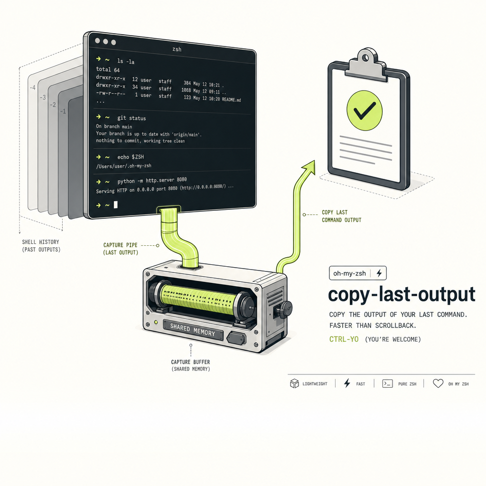

# capture-output

Oh My Zsh plugin that transparently captures every command's output to memory.  
Type `clc` to copy the last command's output to your clipboard. Zero disk I/O.

## Architecture

```
┌─────────────────────────────────────────────────────────────┐
│ Terminal Emulator (iTerm2 / Terminal.app / Warp)            │
└──────────────────────┬──────────────────────────────────────┘
                       │
          ┌────────────▼─────────────┐
          │  zsh-capture-wrapper (C) │
          │                          │
          │  • Creates PTY pair      │
          │  • Relays stdin/stdout   │
          │  • Parses OSC markers    │
          │  • Writes to POSIX shm   │
          └────────────┬─────────────┘
                       │ PTY
          ┌────────────▼─────────────┐
          │  zsh (with OMZ)          │
          │                          │
          │  preexec → \e]7770;B\a   │
          │  precmd  → \e]7770;E\a   │
          └──────────────────────────┘

          ┌──────────────────────────┐
          │  POSIX Shared Memory     │
          │  /dev/shm: /zsh_cap      │
          │                          │
          │  4 MiB ring buffer       │
          │  atomic len + ready flag │
          └────────────┬─────────────┘
                       │
          ┌────────────▼─────────────┐
          │  clc (C)                 │
          │                          │
          │  • Reads shm             │
          │  • Optional ANSI strip   │
          │  • Pipes to pbcopy       │
          └──────────────────────────┘
```

### How it works

1. **`zsh-capture-wrapper`** spawns your shell inside a pseudo-terminal.  
   All I/O passes through the wrapper transparently — interactive programs  
   (vim, less, ssh, fzf) work normally because they talk to a real PTY.

2. The **OMZ plugin** emits invisible OSC escape sequences as boundary markers:
   - `preexec` → `\033]7770;B\007` (begin capture)
   - `precmd` → `\033]7770;E\007` (end capture)

3. The wrapper's byte-level state machine detects these markers, strips them  
   from the terminal output, and buffers everything in between to **POSIX  
   shared memory** (`shm_open`). No temp files, no disk writes.

4. **`clc`** reads the shared memory buffer and pipes it to `pbcopy`.

## Install

```bash
chmod +x install.sh
./install.sh
```

Or manually:

```bash
# Build
make

# Copy to OMZ
cp -R . ~/.oh-my-zsh/custom/plugins/capture-output/

# Add to .zshrc plugins
plugins=( ... capture-output )

# Add BEFORE `source $ZSH/oh-my-zsh.sh`:
if [[ -z "$ZSH_CAPTURE_ACTIVE" ]] && command -v zsh-capture-wrapper &>/dev/null; then
    exec zsh-capture-wrapper
fi
```

## Usage

```bash
$ ls -la /tmp
(normal output)

$ clc                # copy to clipboard (raw, with ANSI colors)
✓ copied 1432 bytes

$ clc --strip        # copy as plain text (ANSI stripped)
✓ copied 1208 bytes (ansi stripped)

$ clc --print        # print to stdout instead of clipboard
$ clc --info         # show buffer stats
```

### Aliases (defined by plugin)

| Alias  | Expands to     |
|--------|---------------|
| `clcs` | `clc --strip` |
| `clcp` | `clc --print` |
| `clci` | `clc --info`  |

## Requirements

- macOS (uses `forkpty` from `<util.h>` and `pbcopy`)
- C17 compiler (Xcode CLT: `xcode-select --install`)
- Oh My Zsh

## Limitations

- Buffer cap is 4 MiB per command. Overflow is silently truncated.
- The wrapper adds ~0.1ms latency per output chunk (pty relay overhead).
- `shm_open` objects persist until reboot or explicit `shm_unlink`.
  The wrapper does NOT unlink on exit so `clc` can still read after
  the shell exits. Run `clc --info` to check status.

## Uninstall

```bash
rm -rf ~/.oh-my-zsh/custom/plugins/capture-output
rm -f /usr/local/bin/zsh-capture-wrapper /usr/local/bin/clc
# Remove the plugins=() entry and exec block from .zshrc
```
